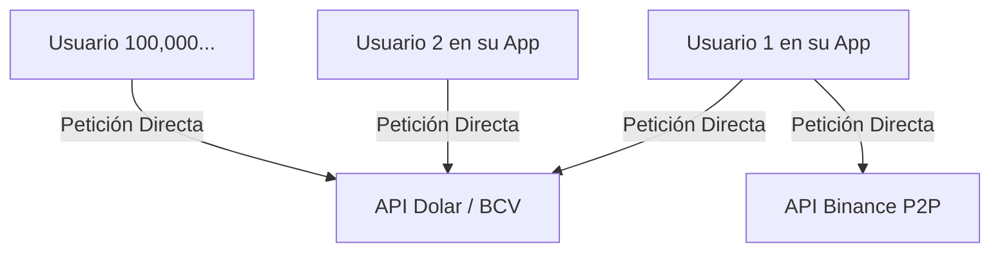
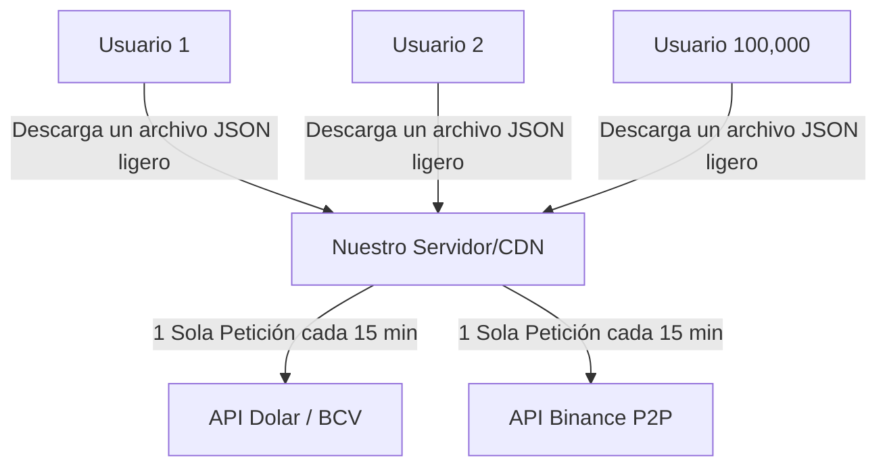

# Plan de Arquitectura: Mecanismo Anti-Saturación de APIs

Este documento explica de manera didáctica cómo vamos a transformar la forma en que la aplicación "TuTasa" obtiene los datos, preparándola para soportar cientos de miles de usuarios simultáneos sin que las APIs (Binance, DolarAPI) nos bloqueen.

## 1. El Problema Actual: Conexión Directa (Peligrosa a escala)

Actualmente, el código en `ratesService.ts` funciona así:

> [!WARNING]
> **¿Por qué es peligroso?**
> Si envías una notificación push y 100,000 usuarios abren la app al mismo tiempo, los teléfonos harán 100,000 peticiones en 1 segundo. Los servidores de Binance o DolarAPI detectarán esto como un ataque cibernético (DDoS), bloquearán la dirección IP y la app dejará de mostrar los precios para todo el mundo.

---

## 2. La Solución: Arquitectura BFF (Backend for Frontend) + Caché

Para solucionar esto, vamos a construir un "Escudo" o "Intermediario" en la nube. La aplicación móvil **nunca** volverá a hablar directamente con Binance o el BCV. Hablará únicamente con nuestro escudo.

> [!TIP]
> **Beneficios de esta arquitectura:**
> 1. **Cero Bloqueos:** A Binance y al BCV solo les llegará **una** petición tuya cada 15 minutos, sin importar cuántos millones de usuarios tengas.
> 2. **Velocidad Extrema:** Tu servidor (Escudo) guardará las tasas en un archivo de texto simple (`tasas.json`). Cuando el usuario abra la app, descargar ese texto tomará milisegundos, haciendo la app rapidísima.
> 3. **Modo Rescate:** Si Binance se cae, tu servidor simplemente le entrega a los usuarios la última tasa guardada. La app nunca se rompe.

---

## 3. Plan de Implementación (Paso a Paso)

Para lograr esto, necesitamos crear un pequeño proyecto backend separado de la app móvil. 

## 3. Plan de Implementación (Plan B: Vercel Serverless)

Ya que Google Cloud no acepta tu tarjeta, ¡no hay problema! Los desarrolladores senior siempre tenemos un "Plan B". Vamos a usar **Vercel**, una plataforma increíble que no pide tarjeta de crédito para proyectos personales y es perfecta para esto.

En lugar de usar un "Cron Job" (que suele ser de pago), usaremos una técnica maestra llamada **"Stale-While-Revalidate" (SWR)**.

### ¿Cómo funciona la técnica SWR en Vercel?
1. No necesitamos Base de Datos.
2. Vercel creará una URL para nosotros (ej. `tutasa.vercel.app/api/rates`).
3. Cuando el Usuario #1 entra, Vercel extrae las tasas del BCV y Binance, y se las entrega, pero **guarda una copia en la memoria de sus servidores globales por 15 minutos**.
4. Si un millón de usuarios entran en esos 15 minutos, Vercel les entrega la copia guardada instantáneamente sin ejecutar nuestro código.
5. Cuando pasa el minuto 16 y entra otro usuario, Vercel le da la copia vieja instantáneamente para no hacerlo esperar, pero **en segundo plano** va sigilosamente al BCV a buscar las tasas nuevas y actualiza la copia.

¡Es brillante, gratis y no satura las APIs!

### Fase 1: Crear la API de Vercel
1. Borraremos la carpeta `functions` que Firebase creó (ya no la necesitamos).
2. Crearemos una carpeta llamada `api` en tu proyecto.
3. Escribiremos el código del scraper ahí dentro (`api/rates.ts`).
4. Lo subiremos a la nube con un solo comando: `npx vercel`.

### Fase 2: Modificar la App Móvil
Iremos a `ratesService.ts` en la app móvil y apuntaremos al nuevo servidor de Vercel.

---

> [!TIP]
> **Vercel es el paraíso del Frontend**
> Vercel es la empresa creadora de Next.js. Su capa gratuita es inmensa y no te pedirán tarjeta de crédito para desplegar esta API.

¿Te parece bien este Plan B? Si me das luz verde, borro la carpeta de Firebase y te escribo el código para Vercel en la nueva carpeta `api`.
